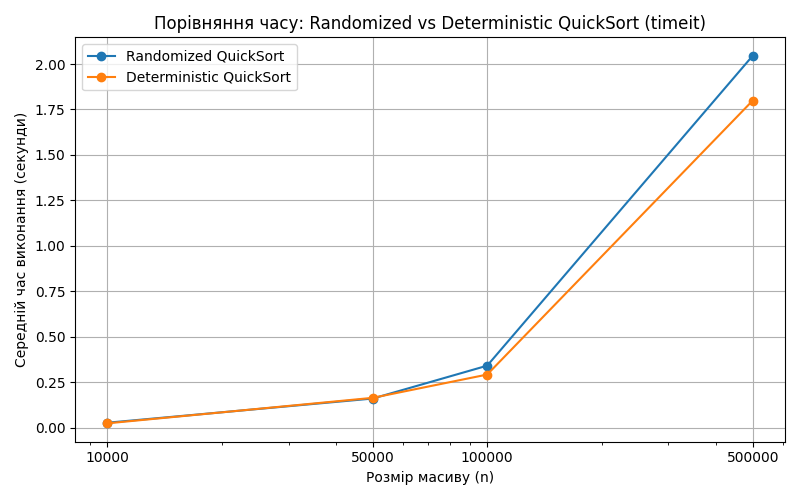

## TASK 1

Розмір масиву: 10000  
   Рандомізований QuickSort: 0.0271 секунд  
   Детермінований QuickSort: 0.0238 секунд  

Розмір масиву: 50000  
   Рандомізований QuickSort: 0.1602 секунд  
   Детермінований QuickSort: 0.1641 секунд  

Розмір масиву: 100000  
   Рандомізований QuickSort: 0.3409 секунд  
   Детермінований QuickSort: 0.2921 секунд  

Розмір масиву: 500000  
   Рандомізований QuickSort: 2.0456 секунд  
   Детермінований QuickSort: 1.7991 секунд  

### Conclusion  
У цих тестах з випадковими вхідними даними рандомізований вибір опорних точок не показав переваги в продуктивності. Детермінований був трохи швидшим для більших масивів. Це, ймовірно, тому, що з дійсно випадковими даними середній елемент часто створює збалансований поділ, а рандомізована опорна точка додає невеликі накладні витрати від додаткової генерації випадкових чисел та заміни. Рандомізоване швидке сортування все ще цінне у випадках, коли вхідні дані можуть бути частково відсортовані, оскільки воно зменшує ризик найгіршої поведінки $O(n^2)$.

## TASK 2  
Розклад занять:  
Наталія Шевченко, 29 років, email: n.shevchenko@example.com  
   Викладає предмети: Хімія, Біологія  

Дмитро Бондаренко, 35 років, email: d.bondarenko@example.com  
   Викладає предмети: Фізика, Інформатика  
   
Олександр Іваненко, 45 років, email: o.ivanenko@example.com  
   Викладає предмети: Математика  
